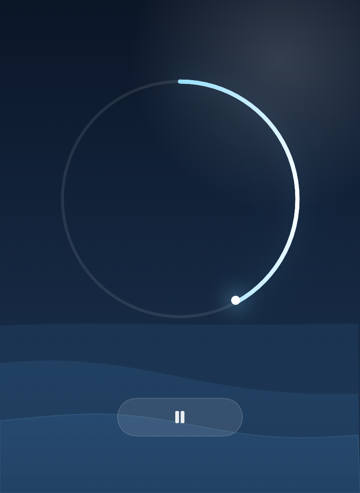

# Flow Timer

A quiet macOS timer. No digits — a ring fills, water drifts underneath, the ring
glows when you're nearly done, and a soft bell marks the end.



## Install

Requires macOS 13 or later and the Xcode Command Line Tools
(`xcode-select --install`). No other dependencies — no Node, no Xcode project,
no package manager.

```
git clone https://github.com/martivbiff/timerproject.git
cd timerproject
./install.sh
```

That compiles the app, puts it in `/Applications`, and opens it.

## Using it

- Tap **1 / 5 / 10 / 25** for a preset, or **drag around the ring** to set any
  length up to an hour (one full turn = 60 minutes).
- **Play** starts it. **Space** toggles start/pause, **Esc** resets.
- At **five minutes remaining** the ring flares and the water swells. On a
  session shorter than five minutes the flare lands in the final fifth instead.
- When the ring closes, a soft bell plays. Tap the check to reset.

There is deliberately no countdown readout. The arc is the only readout.

## Layout

```
Sources/Model.swift        countdown state + the synthesised bell
Sources/Visuals.swift      sky, waves, progress ring
Sources/ContentView.swift  layout, presets, drag-to-set
Sources/FlowTimerApp.swift app entry point and window chrome
Tools/Snapshot.swift       dev-only: renders each state to PNG
Tools/Checks/main.swift    headless checks (timing, clamping, bell envelope)
build.sh                   swiftc → Flow Timer.app
install.sh                 build.sh → /Applications
test.sh                    runs the checks; plays no audio
```

The bell is generated at runtime (three decaying partials around D5), so there
is no audio file in the bundle.

## Notes

The build is ad-hoc signed, which is fine for an app you compile yourself. If
you copy the built `.app` from another machine, macOS will quarantine it —
clear that with `xattr -dr com.apple.quarantine "/Applications/Flow Timer.app"`.
